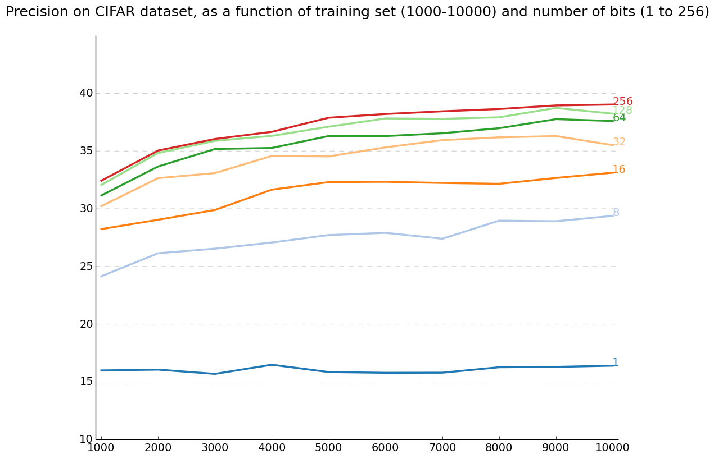

# MyHash

## Binary Codes **Z**
Set all images with same class label (airplane, automobile, bird) to 1 or 0. 
For the 10-classes dataset CIFAR, we have at most 1024 class-label-to-binary setup.

## Binary Hash Function **h**
Fit a binary classifier to each class-label-to-binary setup.

